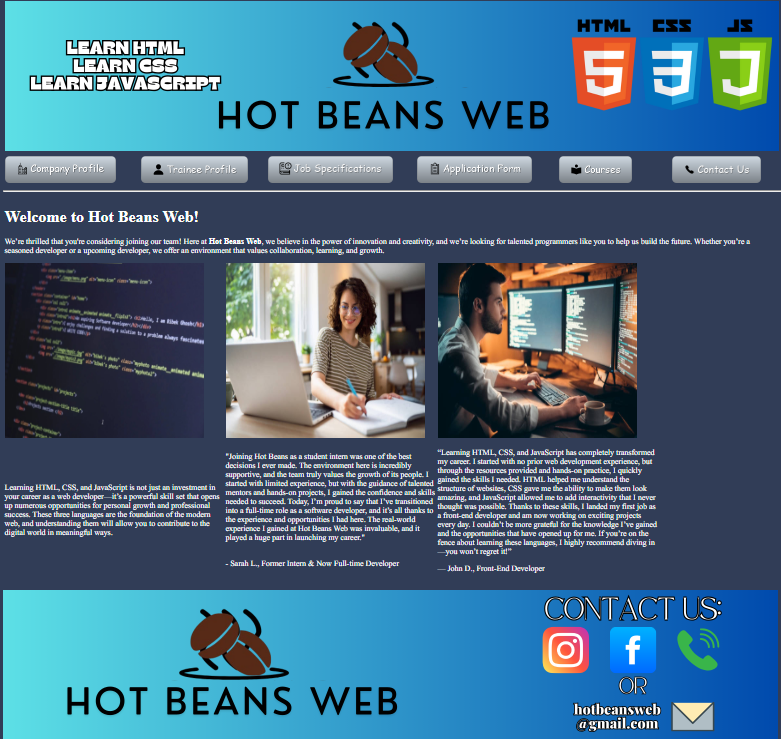
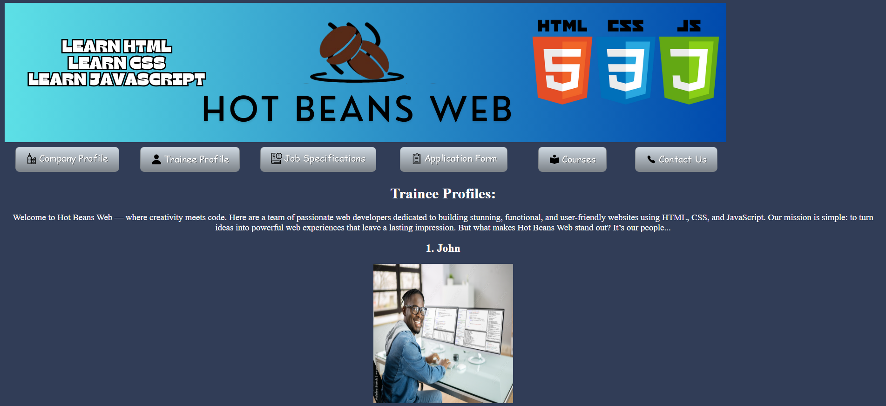
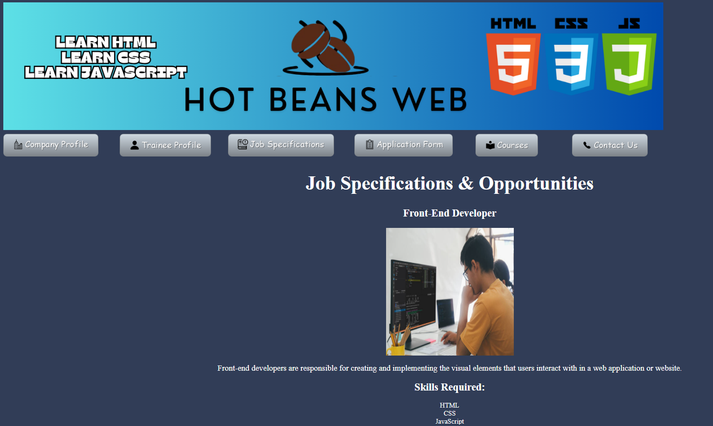
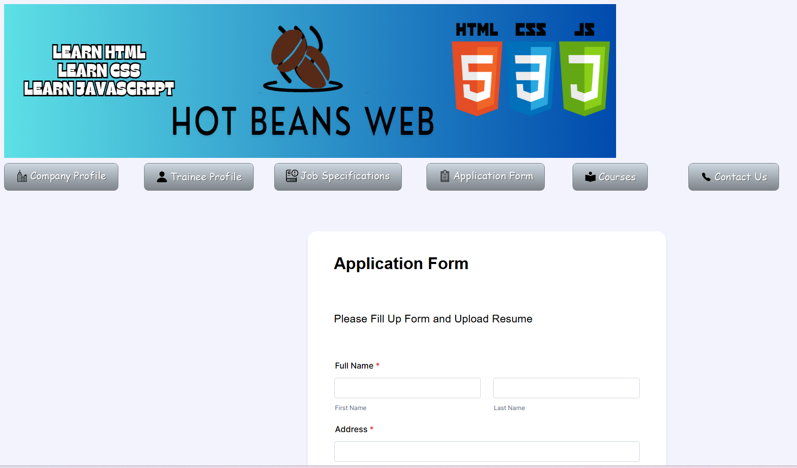
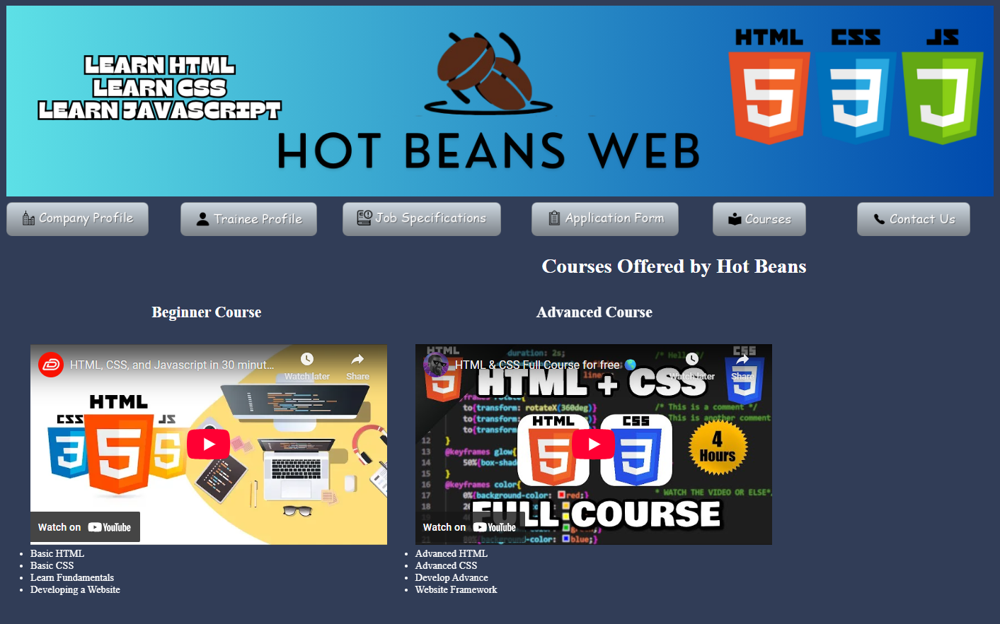

# Bryantllangllang_🌐 Hot Beans Web – Client Website Solution
## 🧾 Project Overview

This project is a **professional website created for Hot Beans Web**, a fictional web development company. It was developed by **Bryant Llang Llang** at **Stanmore College** as part of his BTEC Level 3 IT coursework to simulate real-world web design and client communication.

The purpose of the website is to **attract new junior developers** to join the Hot Beans Web team and to **showcase the company’s services, values, and portfolio**.

---
## 🎯 Project Objectives

- Design a user-friendly, mobile-responsive website
- Meet the requirements provided in the client brief
- Create a platform to promote recruitment of junior developers
- Showcase team member profiles and services
- Practice professional web development standards

---

## 👨‍💼 Target Client

**Hot Beans Web** – A startup web development agency seeking to attract talent and clients through a modern, vibrant, and informative website.

---

## 🛠️ Technologies Used

- HTML5  
- CSS3  
- JavaScript (optional enhancements)  
- GitHub for version control  
- Visual Studio Code for development

---

## 📁 Features Included

- 👋 **Homepage** – Introducing Hot Beans Web and its services  
- 👨‍💻 **Meet the Team** – Profiles of web developers with skills  
- 📩 **Contact Page** – Functional contact form and details  
- 💼 **Join Us** – Section for prospective junior developers  
- 🖼️ **Portfolio (optional)** – Sample work or project gallery  

---

## ✅ How This Meets the Brief

- ✔️ Fully responsive design suitable for desktop, tablet, and mobile
- ✔️ Includes information on how to join the company
- ✔️ Clear layout and consistent branding
- ✔️ Easy-to-navigate menu structure
- ✔️ Professional look and feel suitable for a business client

---

## 📸 Screenshots

### 🏠 Company Profile

### 📞 Contact Page

### 👥 Trainee Profile

### 📞 Job Specification Page

### 👥 Application Form page

### 📞 Courses Page

---

## 🧠 What We Learned

- Real-world application of HTML/CSS
- Understanding client needs and converting them into design
- Importance of accessibility and user-friendly interfaces
- Collaboration using GitHub for version control

---

## 📬 Contact

For feedback or more information, please contact:  
**p.lloh@stanmore.ac.uk**

---

> 💡 *"This project helped bridge the gap between learning to code and solving real client problems."*
